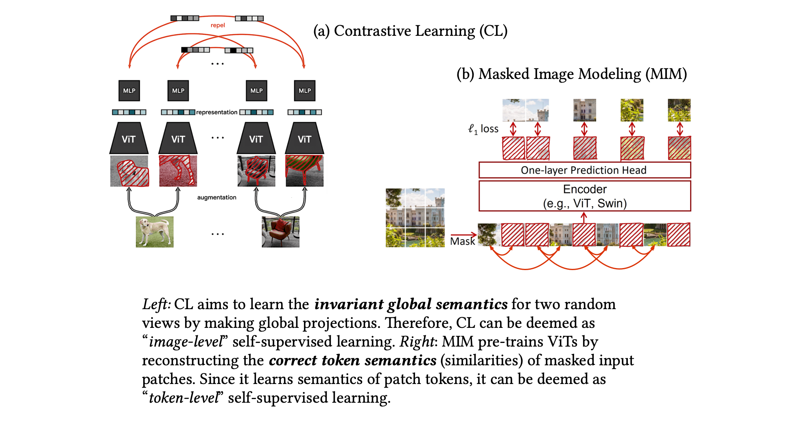
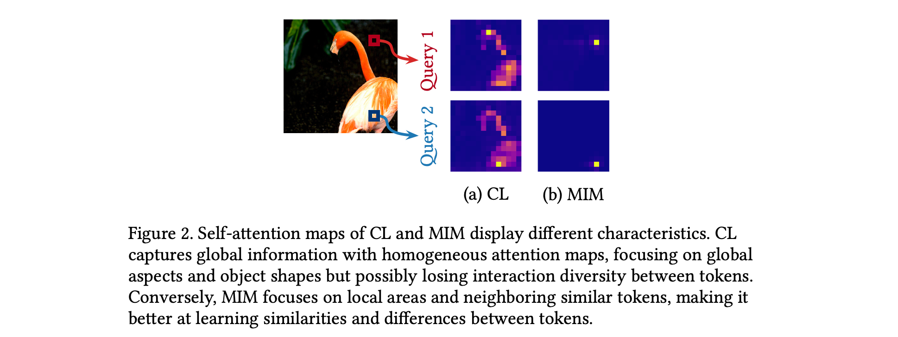
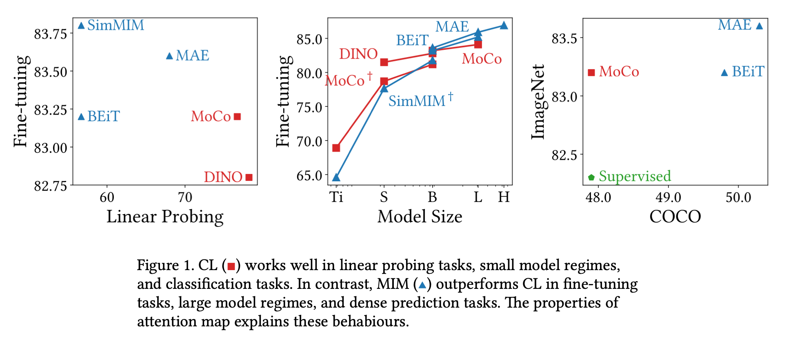
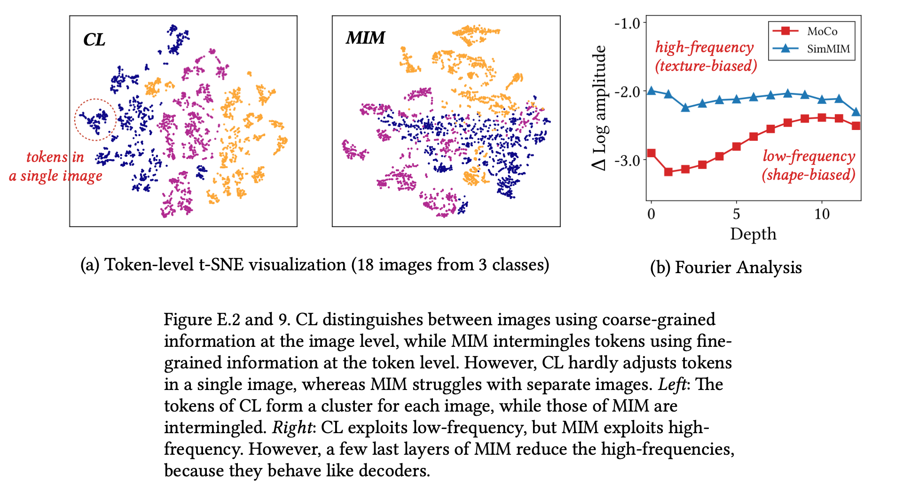
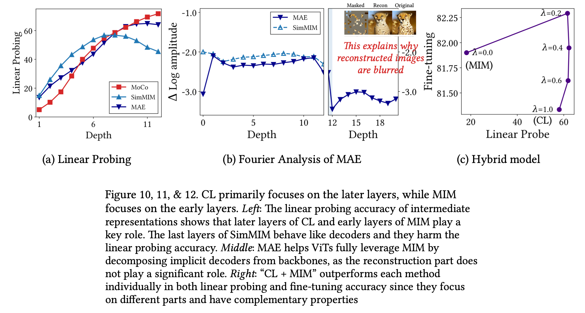
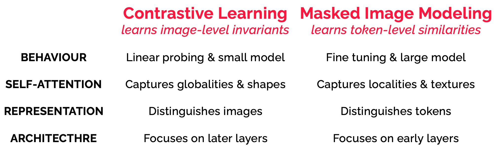

# What Do Self-Supervised Vision Transformers Learn? 

[[paper](https://openreview.net/forum?id=azCKuYyS74), [poster](https://github.com/xxxnell/cl-vs-mim-storage/blob/main/resources/cl_vs_mim_iclr2023_poster.pdf), [slide](https://github.com/xxxnell/cl-vs-mim-storage/blob/main/resources/cl_vs_mim_talk.pdf)]

[Namuk Park](https://www.namukpark.com/)<sup>1*</sup>, 
[Wonjae Kim](https://wonjae.kim/)<sup>2</sup>, 
[Byeongho Heo](https://sites.google.com/view/byeongho-heo/home)<sup>2</sup>, 
[Taekyung Kim](https://scholar.google.es/citations?user=u-9bdkwAAAAJ)<sup>2</sup>, 
[Sangdoo Yun](https://sangdooyun.github.io/)<sup>2</sup>

<sup>1</sup> <sub>Prescient Design, Genentech</sub> 
<sup>2</sup> <sub>NAVER AI LAB</sub> 
<sup>*</sup> <sub>Works done while at NAVER AI Lab</sub> 

<br/>

This repository provides a PyTorch implementation of ["What Do Self-Supervised Vision Transformers Learn (ICLR 2023)."](https://openreview.net/forum?id=azCKuYyS74) In this paper, we delve into the properties of contrastive learning (CL) and masked image modeling (MIM) methods by comparing their learning patterns, providing valuable insights into the unique and complementary aspects of each approach. Specifically, we demonstrate the following:

1. CL primarily captures global patterns, while MIM focuses on local patterns;
2. CL is more shape-oriented, while MIM is more texture-oriented; and
3. CL plays a key role in the later layers of the model, while MIM focuses on the early layers.

These findings consistently indicate that ***CL is an image-level approach, and MIM is a token-level approach***. In other words, CL learns the ***global invariant semantics*** of images, such as object shapes, whereas MIM learns ***token similarity semantics*** discerning which tokens are similar and which are not. Since they capture different types of information, their behavior differs, and they can even complement each other.

<!-- Arch Fig -->
<p align="center">

</p>


Let's find the details below 👇


### How Do Self-Attentions Behave?


<!-- Fig 2 -->
<p align="center">

</p>

The self-attentions of CL and MIM reveal strikingly different behaviors. CL's self-attention captures global information, yet it generates homogeneous attention maps for all query tokens and heads. This implies that it primarily focuses on global invariant aspects and object shapes, possibly sacrificing interaction diversity among tokens. Conversely, MIM's self-attention mainly focuses on local areas, adeptly capturing neighboring similar tokens. This suggests that MIM excels at discerning the similarities and differences between tokens, outshining CL in this regard.

<!-- Fig 1. -->
<p align="center">

</p>

Consequently, CL and MIM behave differently. CL excels at linear probing tasks due to its ability to capture shapes, which helps recognize objects and distinguish images. Although MIM preserves the local information, the correlation with objects or content might not be as strong as with shapes. Furthermore, MIM is more scalable than CL as it effectively leverages diverse representations. Lastly, CL may not be suitable for dense prediction tasks, as self-attention maps and token features are uniform with respect to their spatial coordinates.


### How Are Representations Transformed?

<!-- Fig E.2 and Fig 8. --> 
<p align="center">

</p>

Analyzing representations from a token-level perspective reveals distinct differences between CL and MIM. CL processes all tokens in unison, while MIM handles each token individually. Consistent with their performance in linear probing tasks, CL effectively separates images by capturing object shapes, even though the tokens form clusters for each image. In contrast, MIM's tokens are intermingled, suggesting that they can recognize individual tokens well but lack linear separability. Likewise, CL exhibits a texture bias, while MIM is more shape-biased. This means that CL is robust against small data perturbations.


### Which Components Play an Important Role?

<!-- Fig 11 and Fig  --> 
<p align="center">

</p>

Later layers of CL and early layers of MIM play significant roles. Interestingly, this aligns with the general consensus that early layers typically capture low-level features, such as local patterns, high-frequency signals, and texture information, while later layers capture global patterns, low-frequency signals, and shape information.

Since early layers are crucial in MIM, separating decoders from backbones could be beneficial for fully utilizing their advantages. For this reason, MAE is not only efficient but also an effective method that fully leverages the benefits. MAE reconstructs blurred images as it explicitly decomposes and utilizes the properties of implicit decoders.

Based on these observations, we also discover that CL and MIM can complement each other, and even the simplest harmonization can capitalize on their strengths. Remarkably, the most basic hybrid models outperform those pre-trained with either CL or MIM in both fine-tuning and linear probing accuracy.


<!-- summary figure --> 
<p align="center">

</p>

In summary, we demonstrate that CL and MIM are complementary in three aspects: self-attention, representation, and architecture. This implies that CL learns image-level invariant information, while MIM learns token-level similarity information, leading to differences in their behaviors.


<!--- extra claims -->

<!-- Additionally, you can find the following findings in this papers: 

--> 


## Getting Started

The following packages are required:

* pytorch
* timm
* matplotlib
* scikit-learn
* fastai
* einops
* gdown
* yacs

Install all the dependencies by running the command `pip install -r requirements.txt`.

The pretrained models from [MoCo-v3](https://github.com/facebookresearch/moco-v3) and [SimMIM](https://github.com/microsoft/SimMIM) are provided. The weights are automatically downloaded when you run the code. 

Codes will be available soon. Stay tuned.

<!-- ## Self-Attention Analysis --> 

<!-- attention map visualization, attention distance, normalized mutual information -->

<!-- ## Representation Analysis -->

<!-- t-sne, svd, fourier --> 


## Citation

If you find this useful, please consider citing 📑 the paper and starring 🌟 this repository. Please do not hesitate to contact Namuk Park (email: [namuk.park@gmail.com](mailto:namuk.park@gmail.com), twitter: [xxxnell](https://twitter.com/xxxnell)) with any comments or feedback.

```
@inproceedings{park2023ssl,
  title={What Do Self-Supervised Vision Transformers Learn?},
  author={Park, Namuk and Kim, Wonjae and Heo, Byeongho and Kim, Taekyung and Yun, Sangdoo},
  booktitle={The Eleventh International Conference on Learning Representations},
  year={2023}
}
```

Please also consider citing the following paper (["How Do Vision Transformers Work?" (ICLR 2022 Spotlight)](https://arxiv.org/abs/2202.06709), [code and summary :octocat:](https://github.com/xxxnell/how-do-vits-work)) if you find it useful for analysis techniques, such as Fourier analysis of representations.

```
@inproceedings{park2022how,
  title={How Do Vision Transformers Work?},
  author={Namuk Park and Songkuk Kim},
  booktitle={International Conference on Learning Representations},
  year={2022}
}
```

<!-- ## License -->

<!-- MoCo-v3, SimMIM, [Proving ViTs](https://github.com/sayakpaul/probing-vits) -->

